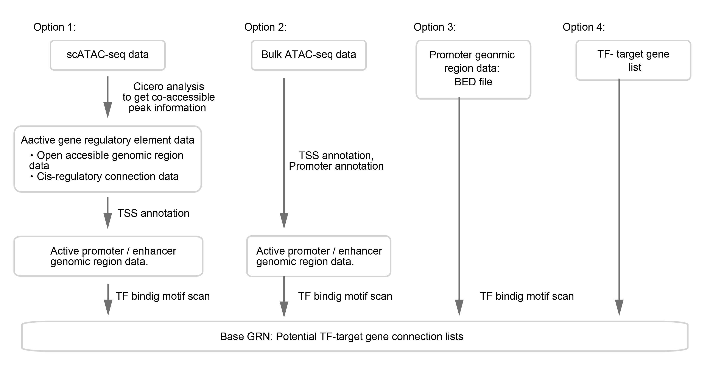

.. _base_grn:

Base GRN input data preparation
===============================

Overview
--------

There are several options for CellOracle base-GRN construction.
These are outlined in the figure below.

- Base GRNs can be constructed from scATAC-seq data (option 1) or bulk ATAC-seq data (option 2). Example workflows for these options are introduced in this notebook.
- Base GRNs can be assembled using data from a promoter database (option 3). Within the CellOracle package, we provide pre-built promoter base GRNs for 10 species. These can be imported using the CellOracle data loading function.
- Base GRNs can also be constructed from a user-supplied TF-target gene list (option 4).

Option1. Preprocessing scATAC-seq data
----------------------------------------------

If you have scATAC-seq data, you can use scATAC-seq data to obtain the accessible promoter/enhancer DNA sequence.
The sample-specific promoter/enhancer data will be converted into base GRN in the later process.
Here, we introduce an example method to extract active promoter/enhancer peaks from scATAC-seq data using Cicero.

.. note::
   Cicero is an R package for scATAC-seq data analysis. Cicero can identify distal cis-regulatory elements in scATAC-seq data.

.. warning::
   - Here, we introduce an example of how to prepare input data of base GRN construction. This notebook is a data preparing example, and **this is NOT CellOracle analysis itself. We do NOT use CellOracle in this step**.
   - We provide this brief example to help new users prep their data. More advanced users may use an existing Cicero workflow if they have one available. To learn more about Cicero, please visit `Cicero's documentation page <https://cole-trapnell-lab.github.io/cicero-release/>`_ for the detailed usage.
   - As noted above, you can use totally different software to idntify gene regulatory elements if you have a favorite algorithm / software for scATAC-data analysis.

Step1. scATAC-seq analysis with Cicero
^^^^^^^^^^^^^^^^^^^^^^^^^^^^^^^^^^^^^^

The jupyter notebook file is available `here <https://github.com/morris-lab/CellOracle/blob/master/docs/notebooks/01_ATAC-seq_data_processing/option1_scATAC-seq_data_analysis_with_cicero/01_atacdata_analysis_with_cicero_and_monocle3.ipynb>`_ .
The R notebook file is available `here <https://github.com/morris-lab/CellOracle/blob/master/docs/notebooks/01_ATAC-seq_data_processing/option1_scATAC-seq_data_analysis_with_cicero/01_atacdata_analysis_with_cicero_and_monocle3.Rmd>`_ .

Or click below to see the contents.

.. toctree::
   :maxdepth: 1

   ../notebooks/01_ATAC-seq_data_processing/option1_scATAC-seq_data_analysis_with_cicero/01_atacdata_analysis_with_cicero_and_monocle3

Step2. TSS annotation
^^^^^^^^^^^^^^^^^^^^^

In this step, we will annotate the active/enhancer peaks from step 1 above.

The jupyter notebook file is available `here <https://github.com/morris-lab/CellOracle/blob/master/docs/notebooks/01_ATAC-seq_data_processing/option1_scATAC-seq_data_analysis_with_cicero/02_preprocess_peak_data.ipynb>`_ .

Or click below to see the contents.

.. toctree::
   :maxdepth: 1

   ../notebooks/01_ATAC-seq_data_processing/option1_scATAC-seq_data_analysis_with_cicero/02_preprocess_peak_data

Once you get the input data, please go to the Motif scan section.

Option2. Data preprocessing of bulk ATAC-seq data
-------------------------------------------------
Bulk ATAC-seq data can also be used to get the accessible promoter/enhancer sequences.

The jupyter notebook file is available `here <https://github.com/morris-lab/CellOracle/blob/master/docs/notebooks/01_ATAC-seq_data_processing/option2_Bulk_ATAC-seq_data/01_preprocess_Bulk_ATAC_seq_peak_data.ipynb>`_ .

Or click below to see the contents.

.. toctree::
   :maxdepth: 1

   ../notebooks/01_ATAC-seq_data_processing/option2_Bulk_ATAC-seq_data/01_preprocess_Bulk_ATAC_seq_peak_data
